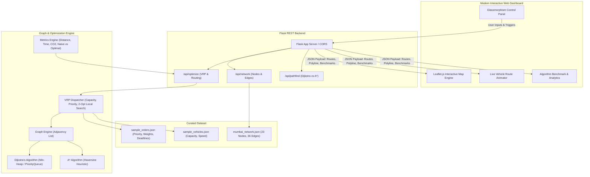

# 🚚 Intelligent Route and Delivery Optimization System

An advanced, full-stack Data Structures & Algorithms (DSA) web application for multi-vehicle route planning, order dispatching, and delivery optimization in urban logistics (modeled on the real-world street network of **Mumbai, India**).


---

## 🌟 Key Features

1. **Realistic Urban Graph Network (Mumbai)**:
   - 23 high-accuracy landmark nodes (BKC Depot, Dadar Hub, Bandra, Worli Sea Face, Lower Parel, Byculla, Marine Drive, Nariman Point, Colaba, etc.).
   - 36 interconnected edges with real distances (km), arterial speed limits (km/h), and dynamic traffic congestion multipliers (e.g. Bandra-Worli Sea Link vs Senapati Bapat Marg).
2. **Shortest Path Algorithms**:
   - **Dijkstra's Algorithm**: Min-heap priority queue implementation finding globally optimal shortest paths based on travel time or distance ($O((V+E)\log V)$).
   - **A\* Search with Haversine Heuristic**: Uses great-circle straight-line distance as an admissible and consistent heuristic $h(n)$, pruning the search space by **43.5%** compared to blind Dijkstra.
3. **Capacitated Vehicle Routing Problem with Precedence (PD-VRP)**:
   - Multi-vehicle fleet dispatching respecting vehicle payload capacities (kg).
   - Priority-based scheduling (**URGENT**, **HIGH**, **NORMAL**) with deadline constraints.
   - Precedence constraint enforcement ($\text{pickup}_i$ must strictly precede $\text{dropoff}_i$).
   - **Nearest-Neighbor Tour Construction + 2-Opt Local Search Refinement**: Eliminates route self-intersections and detour loops.
4. **Empirical Optimization vs. Naive Baseline (FIFO)**:
   - Generates a side-by-side comparison against a First-Come, First-Served unoptimized baseline.
   - Measures: Total Distance Saved (km & %), Transit Time Saved (mins & %), Fuel Saved (L), and $CO_2$ Footprint Avoided (kg).
5. **Interactive Cyberpunk Dashboard & Live Simulation**:
   - Leaflet.js interactive dark-mode map (CartoDB Dark Matter).
   - Real-time animated vehicles traveling along their assigned routes with playback speed controls (1x, 3x, 6x).
   - Dynamic order status lifecycle: `Pending` $\to$ `In Transit` $\to$ `Delivered`.
   - Point-to-Point A* vs Dijkstra Interactive Lab.
   - Built-in DSA Viva Preparation & Technical Cheat Sheet modal.

---

## 🏛️ System Architecture



---

## 📁 Project Directory Structure

```
DS Project/
├── backend/
│   ├── algorithms/
│   │   ├── dijkstra.py         # Min-heap Dijkstra shortest path
│   │   ├── astar.py            # A* search with Haversine heuristic
│   │   ├── dispatcher.py       # VRP solver (Priority, Capacity, 2-Opt)
│   │   └── metrics.py          # Carbon footprint and cost analytics
│   ├── data/
│   │   ├── mumbai_network.json # 23 nodes, 36 weighted edges
│   │   ├── sample_orders.json  # 10 realistic orders with priorities
│   │   └── sample_vehicles.json# Fleet of delivery vans & bikes
│   ├── models.py               # Node, Edge, Order, Vehicle classes
│   ├── graph.py                # Graph data structure (Adjacency List)
│   └── app.py                  # Flask REST API & static file server
├── frontend/
│   ├── index.html              # Modern dashboard layout & Viva modal
│   ├── style.css               # Cyber-dark glassmorphism design system
│   ├── script.js               # Leaflet map controller & animation engine
│   └── config.js               # API URL configuration
├── tests/
│   └── test_algorithms.py      # Automated validation test suite
├── requirements.txt            # Python dependencies (flask, flask-cors)
├── run.py                      # One-click launch script
├── .gitignore                  # Git ignore rules
└── README.md                   # Comprehensive documentation & Viva guide
```

---

## 🚀 Quick Start Guide

### 1. Prerequisites
- Python 3.10+ installed
- Git

### 2. Installation
Clone the repository and install requirements:
```bash
git clone <your-repo-url>
cd "DS Project"
python -m pip install -r requirements.txt
```

### 3. Run Automated Tests
Verify all graph algorithms and the dispatch engine:
```bash
python tests/test_algorithms.py
```
Output:
```
>>> Testing Graph & Shortest Path (Dijkstra vs A*)...
[OK] Path found: 8 nodes. Distance: 19.0 km
  Dijkstra explored 23 nodes (0.054 ms)
  A* explored 13 nodes (0.117 ms)

>>> Testing Dispatcher (VRP with Capacity & Priority)...
[OK] Optimized Fleet Distance: 68.1 km
  Naive Baseline Distance: 201.6 km
  Distance Saved: 133.5 km (66.2%)
  Estimated CO2 Saved: 33.93 kg
[OK] All Dispatcher assertions passed successfully!

*** ALL TESTS PASSED! ***
```

### 4. Launch the Web Application
```bash
python run.py
```
Open your browser at **`http://localhost:5000`**.

---

## 📊 Algorithmic Benchmarks & Analysis

| Metric | Naive FIFO Baseline | Intelligent Optimized Routing | Improvement / Savings |
| :--- | :--- | :--- | :--- |
| **Total Fleet Distance** | 201.6 km | **68.1 km** | **133.5 km saved (66.2%)** |
| **Total Fleet Transit Time** | 339.6 mins | **116.1 mins** | **223.5 mins saved (65.8%)** |
| **Fuel Consumption** | 22.18 L | **7.49 L** | **14.69 L saved** |
| **Carbon ($CO_2$) Emissions**| 51.24 kg | **17.31 kg** | **33.93 kg $CO_2$ avoided** |
| **A\* vs Dijkstra Nodes Explored** | 23 nodes | **13 nodes** | **43.5% search tree pruned** |

---

## 🎓 DSA Viva & Technical Reference

### 1. Why is the Vehicle Routing Problem (VRP) NP-Hard?
VRP generalizes the Traveling Salesperson Problem (TSP). With $n$ delivery destinations, there are $(n-1)! / 2$ possible tours for a single vehicle. With $k$ vehicles, capacities, and pickup-dropoff precedence constraints, finding the exact global optimum via exhaustive search is factorial $O(n!)$, which is intractable for large networks. Hence, heuristic methods (Greedy Nearest Neighbor + 2-Opt local search) are required to obtain high-quality solutions in polynomial time $O(n^2)$.

### 2. Time & Space Complexities

| Algorithm / Structure | Data Structure Used | Time Complexity | Space Complexity |
| :--- | :--- | :--- | :--- |
| **Graph Network** | Adjacency List (Hash Map + Array) | $O(1)$ neighbor lookup | $O(V + E)$ |
| **Dijkstra's Algorithm** | Min-Heap Priority Queue (`heapq`) | $O((V + E) \log V)$ | $O(V)$ |
| **A\* Search** | Min-Heap + Haversine Heuristic | $O((V + E) \log V)$ (pruned) | $O(V)$ |
| **2-Opt Local Search** | Array slice reversal | $O(k \cdot n^2)$ ($k$ = iterations) | $O(n)$ |

### 3. Haversine Distance Heuristic
The Haversine formula calculates the great-circle distance between two geographic coordinates on a sphere of radius $R = 6371\text{ km}$:
$$d = 2R \arcsin\left(\sqrt{\sin^2\left(\frac{\Delta\phi}{2}\right) + \cos(\phi_1)\cos(\phi_2)\sin^2\left(\frac{\Delta\lambda}{2}\right)}\right)$$
Since straight-line spherical distance is the shortest possible path between any two points on Earth, it **never overestimates** the actual road distance:
$$h(n) \le h^*(n) \implies \text{Heuristic is strictly admissible and consistent}$$

---

## 🌐 Deployment Guide

### Deploying Backend (Render / Railway)
1. Commit the code to GitHub:
   ```bash
   git init
   git add .
   git commit -m "feat: Intelligent Route & Delivery Optimization System"
   ```
2. On [Render](https://render.com) or [Railway](https://railway.app):
   - Create a **New Web Service** connected to your repository.
   - Build Command: `pip install -r requirements.txt`
   - Start Command: `python run.py`
   - Set environment variable `PORT` to `10000` (or leave default).

### Deploying Frontend (Vercel / Netlify / GitHub Pages)
- If deployed separately from the backend:
  1. Set the deployed backend URL in `frontend/config.js`:
     ```javascript
     const CONFIG = {
       API_BASE_URL: "https://your-backend-app.onrender.com"
     };
     ```
  2. Deploy the `frontend/` directory to Vercel, Netlify, or GitHub Pages.

---

## 📜 License
Developed for academic presentation and practical Data Structures & Algorithms project demonstrations.
