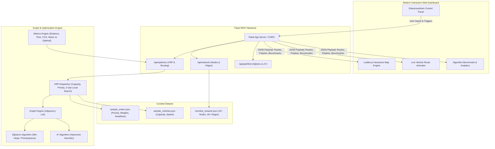

# Intelligent Route and Delivery Optimization System

A full-stack, algorithmic web platform for multi-vehicle route planning, order dispatching, and delivery optimization built for Data Structures & Algorithms (DSA) demonstration and viva presentation.

## User Review Required

> [!IMPORTANT]
> **Python Installation**: Python is not currently installed or configured in the system PATH. We will install Python 3.12 via Windows Package Manager (`winget install Python.Python.3.12`) during the environment setup step.
>
> **Map Region**: The default dataset will feature a realistic urban network in **Mumbai** (covering 22+ landmarks from Bandra Kurla Complex, Lower Parel, Worli, Dadar, Byculla, down to Nariman Point & Colaba) with authentic GPS coordinates and road graph connectivity.

## System Architecture

---

## Proposed Changes

### 1. Environment & Project Foundation
- Initialize Python environment with Python 3.12.
- Set up project virtual environment (`venv`) and install `flask`, `flask-cors`.
- Initialize Git repository with proper `.gitignore` (Python cache, virtual env, IDE files).

#### [NEW] [requirements.txt](file:///c:/Users/ambek_s4dok06/OneDrive/Desktop/DS%20Project/requirements.txt)
- `flask`, `flask-cors`

#### [NEW] [.gitignore](file:///c:/Users/ambek_s4dok06/OneDrive/Desktop/DS%20Project/.gitignore)
- Standard Python, VSCode, OS ignore patterns.

---

### 2. Core Data Structures & Algorithms Engine (`backend/`)

#### [NEW] [models.py](file:///c:/Users/ambek_s4dok06/OneDrive/Desktop/DS%20Project/backend/models.py)
- `Node`: ID, name, lat, lng, type (depot / delivery hub / customer).
- `Edge`: Source, destination, distance (km), speed limit (km/h), traffic multiplier (1.0 = normal, 1.8 = congested), one-way flag.
- `Order`: Order ID, pickup node, dropoff node, package weight (kg), priority (`URGENT`, `HIGH`, `NORMAL`), time window / deadline.
- `Vehicle`: Vehicle ID, name, capacity (kg), current node, speed (km/h), assigned orders, planned path.

#### [NEW] [graph.py](file:///c:/Users/ambek_s4dok06/OneDrive/Desktop/DS%20Project/backend/graph.py)
- `Graph`: Weighted directed/undirected adjacency list with spatial node mapping.
- Methods: `add_node`, `add_edge`, `get_neighbors`, `haversine_distance(node_a, node_b)`.

#### [NEW] [algorithms/dijkstra.py](file:///c:/Users/ambek_s4dok06/OneDrive/Desktop/DS%20Project/backend/algorithms/dijkstra.py)
- Priority-queue (`heapq`) implementation of Dijkstra's algorithm.
- Computes single-pair and all-pairs shortest paths on the road graph.
- Tracks nodes explored count and elapsed execution time (for comparative benchmarks).

#### [NEW] [algorithms/astar.py](file:///c:/Users/ambek_s4dok06/OneDrive/Desktop/DS%20Project/backend/algorithms/astar.py)
- A* algorithm with admissible Haversine great-circle distance heuristic.
- Tracks explored nodes count and search frontier to demonstrate heuristic speedup vs Dijkstra.

#### [NEW] [algorithms/dispatcher.py](file:///c:/Users/ambek_s4dok06/OneDrive/Desktop/DS%20Project/backend/algorithms/dispatcher.py)
- Multi-Vehicle Routing Problem (VRP) solver with constraints:
  1. Priority order scheduling (urgent orders dispatched first).
  2. Vehicle capacity constraints (sum of order weights $\le$ vehicle capacity).
  3. Nearest Neighbor tour construction + 2-Opt local search refinement to eliminate route self-intersections.
  4. Naive baseline generator (First-Come, First-Served unoptimized route) to generate empirical optimization savings.

#### [NEW] [algorithms/metrics.py](file:///c:/Users/ambek_s4dok06/OneDrive/Desktop/DS%20Project/backend/algorithms/metrics.py)
- Calculates:
  - Total travel distance (km).
  - Estimated transit time (minutes) accounting for edge speed limits and traffic.
  - Estimated fuel consumption & carbon emissions ($CO_2$ in kg).
  - Cost savings: Optimized vs Naive baseline (% distance reduction, % time saved).

---

### 3. Curated Urban Road Network Dataset (`backend/data/`)

#### [NEW] [data/mumbai_network.json](file:///c:/Users/ambek_s4dok06/OneDrive/Desktop/DS%20Project/backend/data/mumbai_network.json)
- 22+ high-accuracy Mumbai landmark nodes:
  - Depots: BKC Logistics Hub, Dadar Central Hub.
  - Commercial & Residential: Bandra West, Mahim, Worli Sea Face, Lower Parel, Byculla, Mahalaxmi, Marine Drive, Nariman Point, Colaba Causeway, Fort, CST, Churchgate, Sion, Kurla, etc.
- 40+ realistic interconnecting edges with actual road distance and simulated dynamic traffic weights (Western Express Highway, Eastern Freeway, Sea Link, SV Road, Senapati Bapat Marg).

#### [NEW] [data/sample_orders.json](file:///c:/Users/ambek_s4dok06/OneDrive/Desktop/DS%20Project/backend/data/sample_orders.json)
- Realistic delivery orders with varying weights, urgency levels, and pick/drop locations.

#### [NEW] [data/sample_vehicles.json](file:///c:/Users/ambek_s4dok06/OneDrive/Desktop/DS%20Project/backend/data/sample_vehicles.json)
- Fleet of delivery vans and electric delivery bikes with varied capacities and speeds.

---

### 4. Flask REST API (`backend/app.py`)

#### [NEW] [app.py](file:///c:/Users/ambek_s4dok06/OneDrive/Desktop/DS%20Project/backend/app.py)
- Endpoints:
  - `GET /api/network`: Node locations, edges, traffic status.
  - `GET /api/orders`: List active/sample delivery orders.
  - `POST /api/orders`: Add a new custom order.
  - `GET /api/vehicles`: List vehicle fleet and capacities.
  - `POST /api/vehicles`: Add or reconfigure vehicles.
  - `POST /api/optimize`: Run full dispatch and routing pipeline, returning:
    - Assigned orders per vehicle.
    - Detailed path sequences (node-by-node and lat/lng polyline coordinates).
    - Turn-by-turn route directions.
    - Comparison statistics (Optimized vs Naive FIFO route).
  - `POST /api/pathfind`: Direct point-to-point comparison of Dijkstra vs A* (explored node count, path length, execution time).

---

### 5. Interactive Frontend Application (`frontend/`)

Built with modern Vanilla HTML5, CSS3, and JavaScript (ES6+), integrated with Leaflet.js:

#### [NEW] [frontend/index.html](file:///c:/Users/ambek_s4dok06/OneDrive/Desktop/DS%20Project/frontend/index.html)
- Responsive layout with sidebar controls, analytics panels, and full-screen Leaflet map canvas.
- Modal for "DSA Project Documentation & Viva Cheat Sheet" (explaining time complexities $O((V+E)\log V)$, heuristics, VRP NP-hardness, and 2-opt).

#### [NEW] [frontend/style.css](file:///c:/Users/ambek_s4dok06/OneDrive/Desktop/DS%20Project/frontend/style.css)
- Sleek dark theme with glassmorphism cards, glowing accent colors (`#00f0ff`, `#7000ff`, `#00ff88`), Google Font (`Inter` & `Outfit`), custom Leaflet marker styling, and pulsing vehicle icons.

#### [NEW] [frontend/script.js](file:///c:/Users/ambek_s4dok06/OneDrive/Desktop/DS%20Project/frontend/script.js)
- Map Controller:
  - CartoDB Dark Matter / OpenStreetMap tile layer.
  - Plot nodes (Hubs vs Delivery Locations) with custom SVG icons.
  - Plot road network edges color-coded by traffic condition.
  - Draw multi-colored polylines for distinct vehicle routes.
- Animation Engine:
  - Smooth interpolation of vehicle markers traveling along their designated delivery routes with speed controls (1x, 2x, 5x, pause/play).
- Simulation & Order State Management:
  - Dynamic status changes: "Pending" $\to$ "Picked Up" $\to$ "Delivered".
- Analytics Dashboard:
  - Live charts / stat counters for total distance, fuel saved, delivery completion %, and comparison cards (Naive vs Optimized).
- Interactive Playground:
  - Point-to-point Dijkstra vs A* visualizer mode.

#### [NEW] [frontend/config.js](file:///c:/Users/ambek_s4dok06/OneDrive/Desktop/DS%20Project/frontend/config.js)
- Backend API base URL configuration (supports local execution and one-click cloud deployment).

---

### 6. Documentation & Deployment Setup

#### [NEW] [README.md](file:///c:/Users/ambek_s4dok06/OneDrive/Desktop/DS%20Project/README.md)
- Complete setup guide, architecture diagrams, algorithm explanations, API reference, and deployment guide for Render/Railway (backend) & Vercel/Netlify/GitHub Pages (frontend).

#### [NEW] [run.py](file:///c:/Users/ambek_s4dok06/OneDrive/Desktop/DS%20Project/run.py)
- One-click runner script that launches both the Flask backend and serves the frontend on local ports.

---

## Verification Plan

### Automated Verification
1. Test Python installation and dependency resolution (`flask`, `flask-cors`).
2. Run backend test suite verifying:
   - Dijkstra finds true shortest path on sample triangle and grid graphs.
   - A* heuristic is admissible and yields equivalent optimal cost with $\le$ explored nodes than Dijkstra.
   - Dispatcher respects vehicle capacity limits and priority ordering.
   - 2-Opt improves or maintains tour distance.
   - API endpoints (`/api/network`, `/api/optimize`, `/api/pathfind`) return HTTP 200 with valid JSON schemas.

### Manual & Interactive Browser Verification
1. Launch Flask server and serve the frontend dashboard.
2. Verify Leaflet map loads Mumbai network with interactive nodes and road lines.
3. Click "Run Optimization" and observe:
   - Vehicle assignment to orders according to capacity and priority.
   - Route polylines drawn on the map with vehicle-specific distinct colors.
   - Vehicle markers animate along the path smoothly.
   - Stats panel displays Naive vs Optimized metrics (e.g. 25-40% distance saved).
4. Test the "Dijkstra vs A*" interactive tool between any two selected nodes.
5. Test adding a new custom order and a new vehicle via the UI forms.
